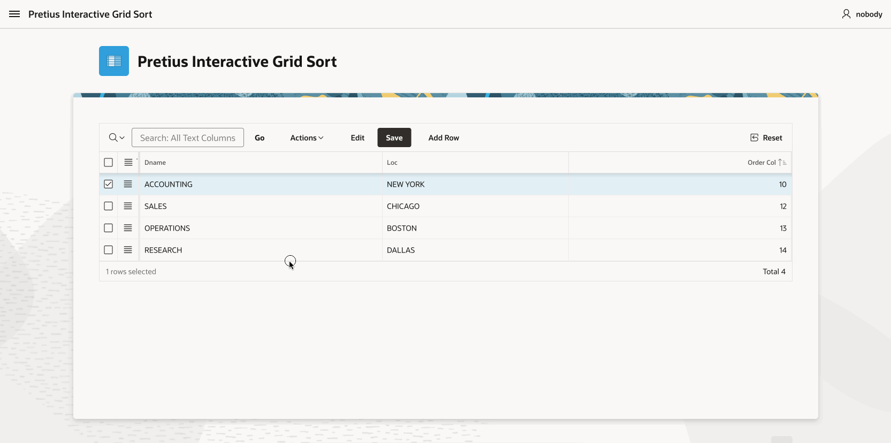
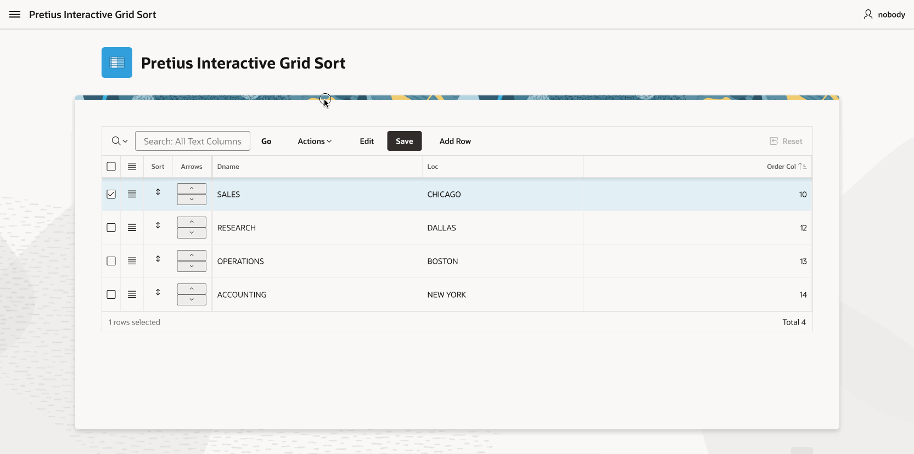

<h1> Pretius Interactive Grid Sort</h1>

[](<LINK>)

- [About Pretius Interactive Grid Sort](#about-pretius-interactive-grid-sort)
- [Demo Application](#demo-application)
- [Plugin Installation and configuration](#plugin-installation-and-configuration)
- [Drag & drop](#drag--drop)
- [Drag & drop using custom handler](#drag--drop-using-custom-handler)
- [Reorder rows using buttons](#reorder-rows-using-buttons)
- [Release History](#release-history)
- [License](#license) 
- [Free support](#free-support) 
- [Commercial support](#commercial-support) 

## About Pretius Interactive Grid Sort
Pretius Interactive Grid Sort is an Oracle APEX dynamic action plugin developed by Tomas Kucharzyk at <a href="https://www.pretius.com" title="https://www.pretius.com">Pretius</a>. Plugin enables you to sort/reorder your Interactive Grid rows by drag and drop or buttons. It is a simple and easy way to change the order of your rows in the Interactive Grid.

<div  style="float: left"><p  align="center">

</p></div>

## Demo Application
Want to see the plugin in action? [Check out the demo application!](https://apex.oracle.com/pls/apex/r/pretius/pretius-interactive-grid-sort)

## Plugin Installation and configuration
 1. Import the plugin sql file **dynamic_action_plugin_pretius_interactive_grid_sort.sql** into your application.
 2. Create a dynamic action on the Interactive Grid region where you want to enable sorting (Selection Change as default).
 3. Add a true action to the dynamic action and choose Pretius Interactive Grid Sort plugin.
 4. Set Affected Element to your Interactive Grid region - this step is important, the plugin will not work without it.
 5. Set the plugin attributes:
   - **Order column ID**: column ID that will be used for sorting (ORDER_COL is default value)
   - **Use custom drag & drop handler**: if you want to use custom drag & drop handler (icon in a column)
   - **Custom handler class**: class of the custom drag & drop handler (icon class used for the drag and drop handler)
   - **Placeholder class**: class of the placeholder (will be used as a placeholder for the dragged row)
 6. The plugin is ready to use. You can now sort your rows by drag & drop. If you want to use custom handler or buttons for sorting, please follow the additional steps below.
 7. Additional steps:

    7.1. To enable sorting only by your handler, it is necessary to use the handler class in one of your columns. You can use the following code to create column:
    - **Create new column**: Create new column (right click on your region columns and Create column). Set type to HTML Expression, use the following code:
    ```html
    <i class="fa fa-arrows-v sort-control" style="font-size: 12px;"></i>
    ```
    7.2. To enable sorting by buttons, you have to create a column with buttons and use the on click function to call the plugin action. You can use the following code to create column with buttons:
    - **Create new column**: Create new column. Set type to HTML Expression, use the following code:
    ```html
    <div class="div-sort-buttons sort-control">
     <button type="button" onclick="pretiusInteractiveGridSort.moveRow(this,'up','ORDER_COL');">
      <i class="fa fa-sort-asc" style="font-size: 12px;"></i>
     </button>
     <button type="button" onclick="pretiusInteractiveGridSort.moveRow(this,'down','ORDER_COL');">
      <i class="fa fa-sort-desc" style="font-size: 12px;"></i>
     </button>
    </div>
    ```
 8. Please be aware that plugin will work only if the Interactive Grid is editable and the order column is present in the Interactive Grid. Also the Affected Element must be set to the Interactive Grid region.

## Drag & drop 
If you want to use drag & drop without custom handler, you dont have to create any additional columns, the sorting will work right out of box.

<div  style="float: left"><p  align="center">

</p></div>

## Drag & drop using custom handler
If you want to use custom handler, please follow the step 6 in the Plugin Installation and configuration section.

<div  style="float: left"><p  align="center">

</p></div>

## Reorder rows using buttons
If you want to use buttons for reorder, please follow the step 7 in the Plugin Installation and configuration section.

<div  style="float: left"><p  align="center">

</p></div>

## Release History
1.0: June 2024

 - Initial version of the plugin

## License
Licensed under the [MIT](LICENSE.txt).

## Free support
Pretius provides free support for the plugins at the GitHub platform. 
We monitor raised issues, prepare fixes, and answer your questions. However, please note that we deliver the plug-ins free of charge, and therefore we will not always be able to help you immediately. 

Interested in better support? 
* [Become a contributor!](#become-a-contributor) We always prioritize the issues raised by our contributors and fix them for free.
* [Consider comercial support.](#comercial-support) Options and benefits are described in the chapter below.

### Bug reporting and change requests
Have you found a bug or have an idea of additional features that the plugin could cover? Firstly, please check the Roadmap and Known issues sections. If your case is not on the lists, please open an issue on a GitHub page following these rules:
* issue should contain login credentials to the application at apex.oracle.com where the problem is reproduced;
* issue should include steps to reproduce the case in the demo application;
* issue should contain description about its nature.

### Implementation issues
If you encounter a problem during the plug-in implementation, please check out our demo application. We do our best to describe each possible use case precisely. If you can not find a solution or your problem is different, contact us: apex-plugins@pretius.com.

## Become a contributor!
We consider our plugins as genuine open source products, and we encourage you to become a contributor. Help us improve plugins by fixing bugs and developing extra features. Comment one of the opened issues or register a new one, to let others know what you are working on. When you finish, create a new pull request. We will review your code and add the changes to the repository.

By contributing to this repository, you help to build a strong APEX community. We will prioritize any issues raised by you in this and any other plugins.

## Commercial support
We are happy to share our experience for free, but we also realize that sometimes response time, quick implementation, SLA, and instant release for the latest version are crucial. That’s why if you need extended support for our plug-ins, please contact us at apex-plugins@pretius.com.
We offer:
* enterprise-level assistance;
* support in plug-ins implementation and utilization;
* dedicated contact channel to our developers;
* SLA at the level your organization require;
* priority update to next APEX releases and features listed in the roadmap.
